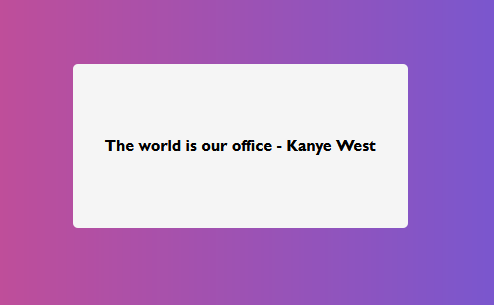

# 🌊KanyeRest quotes 
## Angular + RestAPI + Pipe

Este projeto exibe uma frase do rapper, cantor, compositor, produtor musical e estilista Kanye West, cada vez que a pagina é carregada.

As frases são obtidas consumindo a API: 🌊https://kanye.rest/. 

O pipe personalizado myPipe adiciona a citação " **- Kanye West**" a frase exibida.

Para executar o projeto navegue para o diretório `/rest`.  e execute o comando `ng serve` .

Mais detalhes no arquivo `/rest/README.md`.
